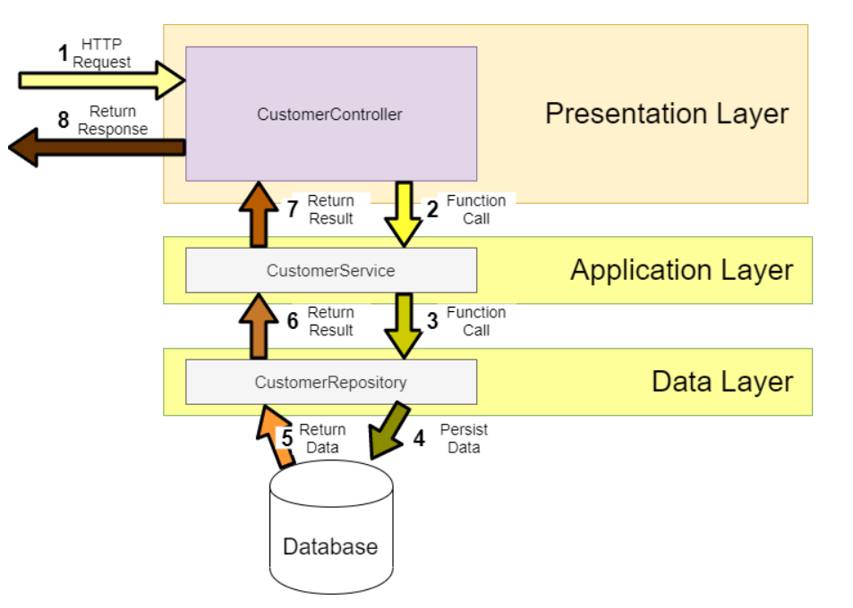
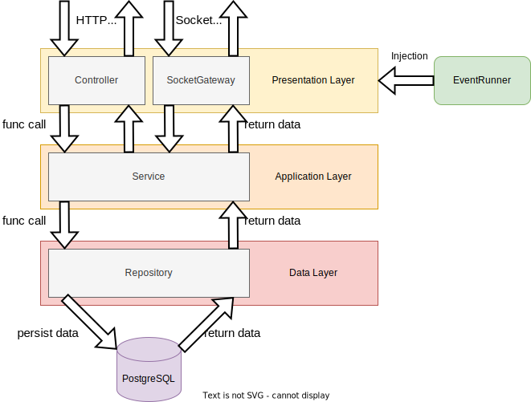

# 소켓 통신/HTTP 통신 구분 기준과 아키텍처

## 목차

프로젝트에 채팅 서비스 등을 구현하는 데 필연적으로 소켓통신을 사용하는데 이를 적용하고 구분하는 과정에 대해 정리하였습니다.

- 소켓 통신과 HTTP 통신의 기준 구분
- 소켓 통신과 HTTP 통신의 기본 흐름 정의
- 아키텍쳐 구성

## 소켓 통신과 HTTP 통신의 기준 구분

일반적인 웹개발에서는 클라이언트의 HTTP 요청과 서버의 응답으로 상호간 통신을 합니다. 하지만 서버가 클라이언트로 메시지를 전송해야 할 상황에서는 소켓 통신을 적용하는 것이 좋습니다.

하지만 저희 백앤드 서버는 다음과 같은 HTTP API 구조를 따르는 것을 상정하고 있었습니다.



(출처 : https://medium.com/java-vault/layered-architecture-b2f4ebe8d587)

여기서 Presentation Layer 계층에 소켓 송/수신을 담당하는 컨트롤러에 해당하는 부분이 삽입될 때, HTTP를 이용해야 하는 부분과 소켓을 이용해야 하는 부분이 명확하지 않던 문제가 있습니다.

예를 들면 사용자가 닉네임을 변경하는 것은 HTTP로 요청을 보내도 되고 소켓으로 요청을 보내도 됩니다. 하지만 불분명한 기준 없이 소켓과 HTTP를 혼용하는 것은 개발 및 유지보수 등 모든 면에서 좋지 않은 것으로 보아 새로운 기준을 만들어 보았습니다.

### HTTP 요청 및 응답

- 영속성과 연관이 있는 부분에 적용
- 단 HTTP 요청에 대한 내용을 다른 클라이언트들에게 전파가 필요할 때엔 서버 → 클라이언트 방향의 소켓통신 사용

### 소켓 통신

- 실시간으로 전달되어야 하는 내용인데 DB에 직접적으로 접근하지 않을 때
- 클라이언트 → 서버 방향은 제한적으로 적용
- 서버 → 클라이언트 방향은 HTTP 요청에서 사용

다음과 같은 기준을 정한 데에는 다음 이유가 있습니다.

- 소켓 통신의 장점은 **서버가 클라이언트**에게 데이터를 먼저 보낼 수 있다는 것이므로 굳이 클라이언트가 서버에 데이터를 보내는 것에 집중할 필요가 없습니다.
- 일반적인 HTTP API 개발 패턴은 위 도식과 같이 요청에 따라 DB에 작업을 수행하고 그에 대한 응답을 보내주는 것을 구현합니다. 이 패턴을 그대로 따라 DB에 작업을 수행하는 동작은 HTTP를 사용하는 것이 바람직해 보입니다.

이렇게 구현하면 Nest.js를 사용해 구현할 때 애매모호한 부분이 있습니다. Nest.js에서는 소켓 통신을 Gateway라는 클래스에서 처리합니다.

예를 들면 다음과 같이 특정 메시지에 대한 내용을 처리한다면 다음과 같이 코딩합니다.

```tsx
@WebSocketGateway({ namespace: 'socket' })
export class ChatGateway {
	@WebSocketServer()
  server: Server; // 서버 측 소켓 객체

	@SubscribeMessage('events')
	handleEvent(client: Socket, data: string) {
	  // events 라는 메시지를 받을 때 처리해야 할 코드
	}
}
```

구조가 HTTP 요청/응답을 처리하는 Controller와 유사한 부분이 있습니다. 그래서 컨트롤러에서 소켓 통신을 날리거나 소켓 통신을 하며 HTTP를 처리하는 것은 부적절해 보인다고 판단했습니다.

특히 서버 → 클라이언트 방향으로 요청을 날릴 때엔 해당 클래스 내부에 정의된 `server` 객체를 이용해서 데이터를 보내야 하는데 이를 HTTP 컨트롤러에서 접근하기 애매한 부분이 있습니다. `server` 객체에 이벤트를 등록해 HTTP 컨트롤러에서 특정 동작이 발생할 때에 이벤트가 발생해 소켓 통신을 하면 좋겠다고 생각했습니다.

그래서 `EventRunner` 라는 클래스를 만들었습니다. `EventRunner` 클래스는 HTTP 컨트롤러와 소켓 통신을 하는 Gateway 두 곳에 모두 주입됩니다.

그리고 Gateway에서 특정 이벤트와 이벤트가 발생할 때 실행되어야 하는 콜백함수를 등록합니다. 콜백함수 내에서는 `server` 객체를 이용해 클라이언트와 소켓 통신을 합니다.

이러한 방식으로 구분하면 HTTP를 담당하는 부분과 Socket을 담당하는 부분을 엄격하게 구분할 수 있었습니다. 그리고 기존 백앤드 아키텍쳐를 깨지 않으며 기존 구조를 최대한 유지하며 가져갈 수 있는 장점이 있습니다.

그래서 HTTP와 소켓 통신이 연동되는 부분은 다음과 같은 구조를 따릅니다. 클라이언트가 HTTP Request를 날릴 때 관련 내용을 다른 클라이언트들에게도 전파를 해야할 때 컨트롤러는 특정 이벤트를 실행하라고 EventRunner에게 요청을 날립니다. 그러면 EventRunner는 이벤트를 실행하여 게이트웨이에서 클라이언트로 소켓 데이터를 날리는 구조가 됩니다.



그래서 최종적으로 저희 프로젝트의 구조는 다음 아키텍쳐를 따르게 됩니다.

