# CI/CD

## CI

지속적 통합의 약자이며 코드에 대한 변경사항이 발생할 경우 혹은 정기적으로 빌드, 테스트, 변경사항 통합 등을 실시하는 과정을 의미합니다.

## CD

지속적 배포의 약자이며 기존 배포된 서비스에 대해 변경 사항을 자동으로 배포하는 것을 의미합니다.

## DevOps

개발 + 운영의 합성어입니다. 개발부터 배포까지의 프로세스를 의미합니다. CI/CD는 DevOps에 포함된 모델 중 하나입니다.

# CI/CD 도구

- Jenkins
  - 자바로 구현되었으며 버전 관리 툴과 연동하여 소스코드의 커밋을 감지하여 특정 동작 (테스트 및 빌드)을 동작하게 할 수 있습니다. 그 외에 여러가지 기능들을 제공합니다.
  - 설정, 초기 세팅이 복잡하며 AWS 등과 연동하기 매우 어려운 편입니다.
- CircleCI
  - 설정이 Jenkins에 비해 간편한 편이며 GitHub 외에 다른 툴과 연동하기 편합니다.
  - yaml 파일로 설정할 수 있습니다.
- GitHub Actions
  - GitHub에서 지원하는 기능이므로 리포지토리를 위한 CI/CD 파이프라인을 위한 별도의 툴을 설치할 필요가 없습니다.
  - 동일한 저장소 내에서 관리할 수 있으며 yaml 파일로 설정할 수 있습니다.

# GitHub Actions

GitHub 리포에 대해 이벤트 (push, pull, merge)가 발생할 때 특정한 동작을 실행하게 하는 기능이자 도구이며 다양한 기능들을 지원합니다. GitHub Actions은 CI/CD만을 위한 기능은 아니지만 CI/CD를 GitHub Actions을 이용해 구현할 수 있습니다.

### 설정 방법

리포지토리의 루트 디렉토리에 `.github/workflows/` 폴더에 yaml 파일로 설정 파일을 커밋하면 설정됩니다.

### 동작 성공과 실패

CI/CD가 정상적으로 실행될 수도 있고 정상적으로 실행이 되지 않을 수도 있습니다. GitHub Actions은 기본적으로 실행하는 프로세스의 exit code로 성공과 실행 여부를 판단합니다. (https://docs.github.com/en/actions/creating-actions/setting-exit-codes-for-actions)

### 환경변수

공개적으로 드러나면 안되는 값 (비밀번호나 키 파일 등)들은 환경변수로 뽑아내어 별도로 설정할 수 있습니다.

### 기본적인 예제 코드

```yaml
name: Hello CI # 워크플로우 이름
on: [push] # 저장소에 push가 발생할 때 아래 작업들을 실행
jobs: # 실행할 작업들 (여러 개를 동시에 실행하거나 순서대로 실행하거나 할 수 있음
  job_test: # 작업 예제 (이름 : job_test)
    runs-on: ubuntu-latest # 구동하는 환경
    steps: # 하나의 작업 내에서 실행할 것들
      - uses: actions/checkout@v2 # 프로젝트 우분투에 체크아웃 (다른사람이 만든 Actions임)
      - name: Hello CI ## 작업 이름
        run: exit ${{ secrets.EXIT_VALUE }} ## 리포지토리의 값을 받아서 exit code 지정
```

위 코드는 리포지토리의 환경 변수로 설정한 값에 따라 성공하거나 실패하게 됩니다.

## 용어

### 워크플로우

워크플로우는 특정 작업을 실행하기 위한 설정 가능한 자동화된 프로세스입니다.

### 이벤트

워크플로우를 동작시킬 수 있는 저장소에 대한 특별한 동작입니다. 예를 들면 이슈 생성, 풀 리퀘스트, 커밋 등이 있습니다.

### 잡

하나의 워크플로우 내 작업의 단위를 의미합니다. 쉘 스크립트를 실행하거나 하는 동작을 수행합니다.

### 액션

GitHub Action 플랫폼에서 구동할 수 있는 앱을 의미합니다. 기존에 존재하는 여러 유용한 액션들이 많으며 본인이 만들수도 있습니다.

### 캐시

maven, gradle, npm처럼 종속 모듈이 있는 프로젝트들은 테스트를 구동하기 전에 종속 모듈들을 내려받아야 합니다. 하지만 워크플로우에서 매번 지우고 새로 내려받고 하면 자원 낭비 및 시간 낭비가 심합니다. 그래서 이에 대해 종속 모듈들을 캐시할 수 있습니다.

캐시는 보통 GitHub 공식 액션 `actions/cache@v2` 를 사용합니다. (https://github.com/actions/cache)

### 캐시 예제

```yaml
- name: 모듈들 캐싱
  uses: actions/cache@v2
  with:
    # 캐시할 폴더나 파일을 적는다. 하나 혹은 여러 개 적을 수 있다.
    path: |
      ${{ github.workspace }}/node_modules
    # 이전과 동일한 키값이 나오면 출력인 cache-hit는 false가 된다.
    # 현재 작업폴더 내 모든 package_lock.json 파일들을 해시한다.
    key: npm-packages-${{ hashFiles('**/package_lock.json') }}
  id: cache
- name: 백앤드 모듈들 설치
  if: steps.cache.outputs.cache-hit != 'true'
  run: npm install
```

# PPiing의 CI/CD

PPiing은 리포지토리가 총 4개로 나누어져 있습니다. 각자의 역할은 다음과 같습니다.

- PPoong : 프로젝트의 루트 디렉토리
  - Docker-Compose로 backend, frontend, upload 프로젝트의 이미지를 빌드하여 구동시킴
  - 개발 모드인 경우 backend, frontend, upload 프로젝트의 이미지를 빌드하지 않음.
  - 별도의 소스코드가 없으며 환경 구성을 담당함
  - DB (PostgreSQL)도 해당 디렉토리에 구성됨
  - CI 불필요, CD 필요
- backend : 프로젝트의 백앤드 디렉토리
  - 배포 단계에서 Docker로 빌드하여야 하므로 Dockerfile이 존재
  - 소스코드에 대한 CI 필요
    - lint 검사, 빌드, 단위 테스트, 통합 테스트 수행
  - CI 성공시 main 브랜치인 경우 CD 필요
- frontend : 프로젝트의 프론트앤드 디렉토리
  - 배포 단계에서 Docker로 빌드하여야 하므로 Dockerfile이 존재
  - 소스코드에 대한 CI 필요
    - lint 검사, 빌드 수행 (테스트는 추후에 추가)
  - CI 성공시 main 브랜치인 경우 CD 필요
- upload : TBD

## backend, frontend, upload가 수행하는 액션



## 참조

https://fe-developers.kakaoent.com/2022/220106-github-actions/

https://meetup.toast.com/posts/286